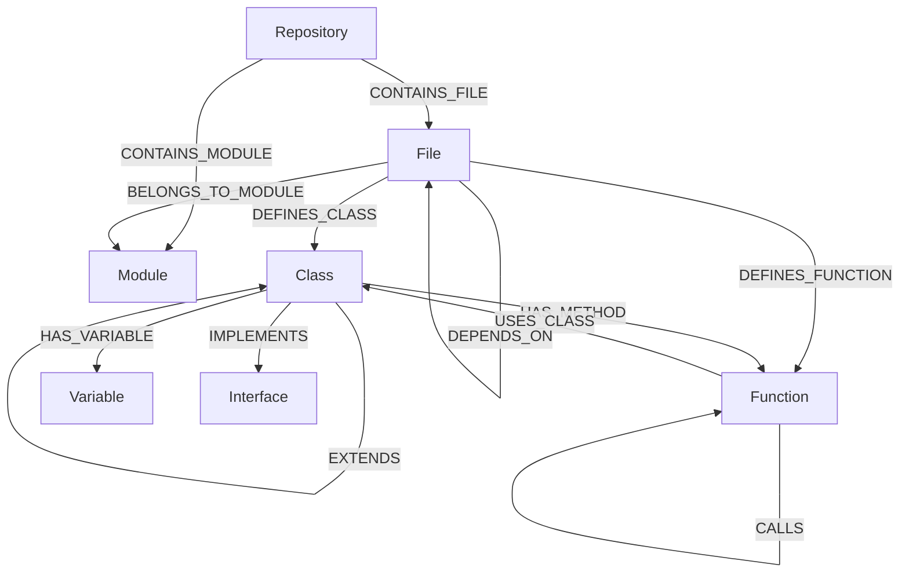

# Code Knowledge Graph (Code-KAG)

A **Knowledge-Augmented Generation (KAG)** system for code that creates a Neo4j graph database of your codebase, enabling semantic code search and intelligent context retrieval for AI assistants.

## What It Does

Code-KAG parses your codebase and creates a knowledge graph with:

- **Files, Modules, Classes, Functions, Interfaces** as nodes
- **Relationships** like CALLS, IMPORTS, EXTENDS, IMPLEMENTS, DEPENDS_ON
- **Rich metadata** including docstrings, signatures, complexity metrics, language types

This graph enables AI assistants to:
- Find relevant code by semantic search
- Understand call chains and dependencies
- Navigate class hierarchies
- Identify related/similar code
- Get comprehensive context for any code entity

## Supported Languages

| Language | Extensions | Parser | Entity Mapping |
|----------|-----------|--------|----------------|
| **Python** | `.py`, `.pyw` | stdlib `ast` | Classes, functions, variables, imports |
| **TypeScript/JavaScript** | `.ts`, `.tsx`, `.js`, `.jsx` | tree-sitter | Classes, interfaces, enums, arrow functions, ES6 imports |
| **Java** | `.java` | tree-sitter | Classes, enums, interfaces, annotations, access modifiers |
| **Go** | `.go` | tree-sitter | Structs, interfaces, receiver methods, visibility by capitalization |
| **Rust** | `.rs` | tree-sitter | Structs, enums, traits, impl blocks, `pub` visibility |
| **C/C++** | `.c`, `.cpp`, `.cc`, `.cxx`, `.h`, `.hpp`, `.hxx` | tree-sitter | Classes, structs, namespaces, `#include` imports |

## Data Model



### Language Type Mapping

The `Class` node includes a `languageType` property to preserve language-specific semantics:

| `languageType` | Used For |
|----------------|----------|
| `class` | Python classes, Java classes, TypeScript classes, C++ classes |
| `struct` | Go structs, Rust structs, C/C++ structs |
| `enum` | Java enums, TypeScript enums, Rust enums, C++ enums |
| `trait` | Rust traits |
| `interface` | Go interfaces, Java interfaces, TypeScript interfaces |

## Quick Start (Docker - Recommended)

Everything runs in containers, no local installation needed!

### 1. Clone and Start

```bash
git clone https://github.com/yourusername/code-kag.git
cd code-kag

# Make the script executable
chmod +x start.sh

# Start Neo4j database
./start.sh start
```

### 2. Index Your Code

```bash
# Index a repository (all supported languages)
./start.sh index /path/to/your/project

# Or with a custom ID
./start.sh index /path/to/project my-project-id
```

### 3. Explore Your Graph

Open http://localhost:7474 in your browser:
- **Username:** neo4j
- **Password:** code-kag-password

Try this query:
```cypher
MATCH (c:Class)-[:HAS_METHOD]->(f:Function)
RETURN c.name, c.languageType, collect(f.name) as methods
LIMIT 10
```

### 4. Configure MCP for Claude

Add to `~/.config/claude/claude_desktop_config.json`:

```json
{
  "mcpServers": {
    "code-kag": {
      "command": "docker",
      "args": ["exec", "-i", "code-kag-server", "python", "src/mcp_server.py"],
      "env": {}
    }
  }
}
```

Then start the MCP server:
```bash
./start.sh mcp
```

## How Indexing Works

```
1. DISCOVERY
   - Walk directory tree
   - Find all supported source files (.py, .ts, .java, .go, .rs, .c, .cpp, etc.)
   - Skip __pycache__, venv, node_modules, .git, build dirs

2. PARSE EACH FILE
   - Route to the correct language parser via the registry
   - Python: stdlib ast module
   - All others: tree-sitter grammars
   - Extract: Classes, Functions, Variables, Imports, Interfaces
   - Track: function calls, class usages, method receivers

3. RESOLVE CROSS-REFERENCES
   - Match function calls to definitions
   - Resolve class inheritance and trait implementations
   - Link file imports

4. DATABASE SETUP
   - Connect to Neo4j
   - Create constraints (unique IDs)
   - Create indexes (names, docstrings)

5. BATCH INSERT
   - UNWIND + MERGE all nodes
   - MATCH + MERGE all relationships

6. COMPLETE
   - Report statistics
```

See [docs/INDEXING_FLOW.md](docs/INDEXING_FLOW.md) for detailed sequence diagram.

## Git Hooks (Automatic Re-indexing)

Code-KAG can install git hooks to automatically keep the knowledge graph in sync with your codebase.

### Install Hooks

```bash
# Install hooks with incremental mode (default)
python cli.py hooks install /path/to/repo --id my-project --mode incremental

# Install hooks with full re-index mode
python cli.py hooks install /path/to/repo --id my-project --mode full

# With custom Neo4j credentials
python cli.py --neo4j-password code-kag-password hooks install /path/to/repo --id my-project
```

### Uninstall Hooks

```bash
python cli.py hooks uninstall /path/to/repo
```

### What the Hooks Do

| Hook | Trigger | Action |
|------|---------|--------|
| `post-commit` | After each commit | Incremental re-index of changed files |
| `post-merge` | After `git pull`/merge | Incremental re-index of changed files |
| `post-checkout` | Branch switch | Full re-index |
| `post-rewrite` | After rebase/amend | Full re-index |

### Hook Features

- **Neo4j connectivity check** — hooks verify Neo4j is reachable before attempting re-index. If not, a warning is printed with a manual re-index command
- **Logging** — all re-index runs are logged to `/tmp/code-kag-reindex-{REPO_ID}.log` with timestamps and success/failure status
- **Python auto-detection** — hooks prefer the project's `.venv/bin/python`, then `python3`, then `python`
- **Credential passthrough** — Neo4j URI, username, and password are baked into the hooks at install time
- **Lockfile debouncing** — prevents concurrent re-index runs
- **Hook chaining** — existing hooks are preserved by backing them up to `*.pre-code-kag` and chaining them
- **Shell injection protection** — all template values are validated against unsafe characters

## Available MCP Tools (13)

All query tools accept an optional `repo_id` parameter to scope results to a single repository. Omit it to search across all indexed repos.

### index_repository
Index a repository into the knowledge graph. Parses all supported source files and creates nodes/relationships in Neo4j.
```
"Index the project at /repos/my-app with ID my-app"
```

### search_code
Search for functions, classes, or files by name or content.
```
"Find all functions related to database connection"
"Search for 'authentication' in my-project only" (pass repo_id: "my-project")
```

### get_function_details
Get comprehensive details about a specific function.
```
"Show me details about the parse_config function"
```

### get_class_details
Get class information including methods and hierarchy.
```
"What methods does the UserService class have?"
```

### get_call_graph
See what functions a given function calls (and transitively).
```
"Show me the call graph for handle_request"
```

### get_class_hierarchy
View inheritance relationships.
```
"What classes extend BaseModel?"
```

### get_file_dependencies
See import/dependency relationships between files.
```
"What files depend on utils.py?"
```

### find_similar_code
Find functions with similar patterns.
```
"Find functions similar to validate_input"
```

### find_entry_points
Find top-level functions that aren't called by other code.
```
"What are the entry points in this codebase?"
```

### find_high_complexity_functions
Identify complex functions that might need refactoring.
```
"Show me the most complex functions"
```

### get_code_context
Get comprehensive context for any code entity including all relationships.
```
"Give me the full context for the UserService class"
```

### get_graph_stats
Get per-repository statistics about the knowledge graph (files, classes, functions, etc.).
```
"Show me stats for my-project"
```

### health_check
Check the health of the Code-KAG system (Neo4j connectivity, node counts, uptime).
```
"Is the code-kag system healthy?"
```

## Project Structure

```
code-kag/
├── src/
│   ├── __init__.py
│   ├── models.py              # Data models (Class, Function, Interface, etc.)
│   ├── parser.py              # CodebaseParser — file discovery & orchestration
│   ├── languages.py           # Language parser registry & routing
│   ├── parsers/
│   │   ├── __init__.py
│   │   ├── tree_sitter_base.py    # Shared base class for tree-sitter parsers
│   │   ├── typescript_parser.py   # TypeScript/JavaScript (.ts, .tsx, .js, .jsx)
│   │   ├── java_parser.py         # Java (.java)
│   │   ├── go_parser.py           # Go (.go)
│   │   ├── rust_parser.py         # Rust (.rs)
│   │   └── cpp_parser.py          # C/C++ (.c, .cpp, .cc, .h, .hpp, etc.)
│   ├── hooks/
│   │   ├── __init__.py
│   │   ├── hook_manager.py        # Install/uninstall git hooks
│   │   └── templates/             # Shell hook templates
│   │       ├── common.sh
│   │       ├── post-commit.sh
│   │       ├── post-merge.sh
│   │       ├── post-checkout.sh
│   │       └── post-rewrite.sh
│   ├── neo4j_ingester.py     # Neo4j ingestion (full & incremental) and queries
│   └── mcp_server.py         # MCP server implementation
├── tests/
│   ├── conftest.py            # Shared fixtures & sample code for all languages
│   ├── test_models.py
│   ├── test_python_parser.py
│   ├── test_typescript_parser.py
│   ├── test_java_parser.py
│   ├── test_go_parser.py
│   ├── test_rust_parser.py
│   ├── test_cpp_parser.py
│   ├── test_language_registry.py
│   ├── test_codebase_parser.py
│   ├── test_hooks.py
│   ├── test_cli.py
│   └── test_neo4j_ingester.py
├── config/
│   └── mcp_config.example.json
├── scripts/                   # Utility scripts
├── docs/                      # Documentation
│   └── INDEXING_FLOW.md
├── cli.py                     # CLI — index, hooks install/uninstall
├── Dockerfile
├── docker-compose.yml
├── healthcheck.py
├── start.sh
├── requirements.txt
├── setup.py
└── README.md
```

## CLI Commands

```bash
# Full index of a repository (all supported languages)
python cli.py index /path/to/repo --id project-name

# Incremental index (only re-parse specific files)
python cli.py index /path/to/repo --id project-name --incremental --changed-files src/main.py src/util.ts

# Install git hooks for automatic re-indexing
python cli.py hooks install /path/to/repo --id project-name --mode incremental

# Install hooks with custom Neo4j credentials
python cli.py --neo4j-password code-kag-password hooks install /path/to/repo --id project-name

# Uninstall git hooks
python cli.py hooks uninstall /path/to/repo

# Check hook re-index log
cat /tmp/code-kag-reindex-project-name.log

# Search code (all repos)
python cli.py search "authentication"

# Search code (scoped to one repo)
python cli.py search "authentication" --repo-id my-project

# Get function info
python cli.py function my_function_name
python cli.py function my_function_name --repo-id my-project

# Get call graph
python cli.py callgraph "file.py:MyClass:method" --depth 3

# Start MCP server manually
python cli.py serve

# Show statistics
python cli.py stats
```

## Environment Variables

| Variable | Default | Description |
|----------|---------|-------------|
| `NEO4J_URI` | `bolt://localhost:7687` | Neo4j connection URI |
| `NEO4J_USERNAME` | `neo4j` | Neo4j username |
| `NEO4J_PASSWORD` | `password` | Neo4j password |

## Development

```bash
# Create a virtual environment
python3 -m venv .venv
source .venv/bin/activate

# Install dependencies
pip install -r requirements.txt
pip install pytest

# Run tests (206 tests)
pytest tests/ -v

# Format code
black .

# Type checking
mypy src/
```

## Example Queries

Once indexed, you can query the graph directly in Neo4j Browser:

```cypher
-- Find all functions that call a specific function
MATCH (caller:Function)-[:CALLS]->(f:Function {name: 'validate_input'})
RETURN caller.name, caller.signature

-- Find Go structs vs Python classes
MATCH (c:Class)
RETURN c.languageType, count(*) AS count
ORDER BY count DESC

-- Find classes with many methods
MATCH (c:Class)-[:HAS_METHOD]->(m:Function)
WITH c, count(m) AS methodCount
WHERE methodCount > 10
RETURN c.name, methodCount
ORDER BY methodCount DESC

-- Find circular dependencies
MATCH path = (f1:File)-[:DEPENDS_ON*2..5]->(f1)
RETURN path

-- Find unused functions
MATCH (f:Function)
WHERE NOT ()-[:CALLS]->(f)
AND NOT f.name STARTS WITH '_'
RETURN f.name, f.id

-- Find all trait/interface implementations
MATCH (c:Class)-[:IMPLEMENTS]->(i)
RETURN c.name, c.languageType, i AS implements
```

## Contributing

1. Fork the repository
2. Create a feature branch
3. Make your changes
4. Run tests (`pytest tests/ -v`)
5. Submit a pull request

## License

MIT License - see LICENSE file for details.

## Acknowledgments

- [Neo4j](https://neo4j.com/) for the graph database
- [MCP](https://modelcontextprotocol.io/) for the AI integration protocol
- [Python AST](https://docs.python.org/3/library/ast.html) for Python code parsing
- [tree-sitter](https://tree-sitter.github.io/) for multi-language parsing
