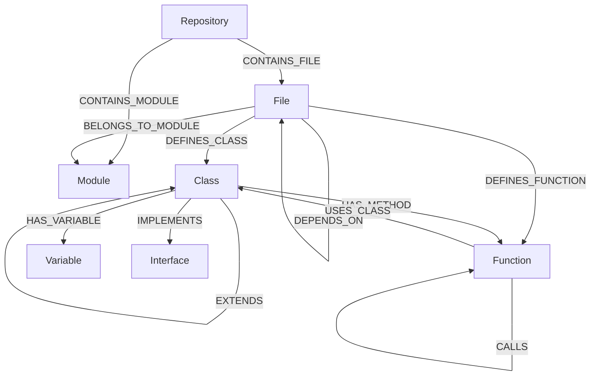

# Code Knowledge Graph (Code-KAG)

A **Knowledge-Augmented Generation (KAG)** system for code that creates a Neo4j graph database of your codebase, enabling semantic code search and intelligent context retrieval for AI assistants.

## 🎯 What It Does

Code-KAG parses your codebase and creates a knowledge graph with:

- **Files, Modules, Classes, Functions** as nodes
- **Relationships** like CALLS, IMPORTS, EXTENDS, DEPENDS_ON
- **Rich metadata** including docstrings, signatures, complexity metrics

This graph enables AI assistants to:
- Find relevant code by semantic search
- Understand call chains and dependencies
- Navigate class hierarchies
- Identify related/similar code
- Get comprehensive context for any code entity

## 🌐 Supported Languages

| Language | Status | Parser |
|----------|--------|--------|
| **Python** | ✅ Full support | Python AST |
| TypeScript/JavaScript | 🚧 Planned | tree-sitter |
| Java | 🚧 Planned | tree-sitter |
| Go | 🚧 Planned | tree-sitter |
| Rust | 🚧 Planned | tree-sitter |
| C/C++ | 🚧 Planned | tree-sitter |

## 📊 Data Model



## 🚀 Quick Start (Docker - Recommended)

Everything runs in containers, no local installation needed!

### 1. Clone and Start

```bash
git clone https://github.com/yourusername/code-kag.git
cd code-kag

# Make the script executable
chmod +x start.sh

# Start Neo4j database
./start.sh start
```

### 2. Index Your Code

```bash
# Index a repository
./start.sh index /path/to/your/project

# Or with a custom ID
./start.sh index /path/to/project my-project-id
```

### 3. Explore Your Graph

Open http://localhost:7474 in your browser:
- **Username:** neo4j
- **Password:** code-kag-password

Try this query:
```cypher
MATCH (c:Class)-[:HAS_METHOD]->(f:Function)
RETURN c.name, collect(f.name) as methods
LIMIT 10
```

### 4. Configure MCP for Claude

Add to `~/.config/claude/claude_desktop_config.json`:

```json
{
  "mcpServers": {
    "code-kag": {
      "command": "docker",
      "args": ["exec", "-i", "code-kag-server", "python", "src/mcp_server.py"],
      "env": {}
    }
  }
}
```

Then start the MCP server:
```bash
./start.sh mcp
```

## 🔄 How Indexing Works

```
┌─────────────────────────────────────────────────────────────────┐
│                    INDEXING SEQUENCE                            │
├─────────────────────────────────────────────────────────────────┤
│                                                                 │
│  1. DISCOVERY                                                   │
│     └─→ Walk directory tree                                     │
│     └─→ Find all .py files                                      │
│     └─→ Skip __pycache__, venv, node_modules, .git              │
│                                                                 │
│  2. PARSE EACH FILE                                             │
│     └─→ Read source code                                        │
│     └─→ Parse with Python AST                                   │
│     └─→ Extract: Classes, Functions, Variables, Imports         │
│     └─→ Track: function calls, class usages                     │
│                                                                 │
│  3. RESOLVE CROSS-REFERENCES                                    │
│     └─→ Match function calls to definitions                     │
│     └─→ Resolve class inheritance                               │
│     └─→ Link file imports                                       │
│                                                                 │
│  4. DATABASE SETUP                                              │
│     └─→ Connect to Neo4j                                        │
│     └─→ Create constraints (unique IDs)                         │
│     └─→ Create indexes (names, docstrings)                      │
│                                                                 │
│  5. BATCH INSERT                                                │
│     └─→ UNWIND + MERGE all nodes                                │
│     └─→ MATCH + MERGE all relationships                         │
│                                                                 │
│  6. COMPLETE                                                    │
│     └─→ Report statistics                                       │
│                                                                 │
└─────────────────────────────────────────────────────────────────┘
```

See [docs/INDEXING_FLOW.md](docs/INDEXING_FLOW.md) for detailed sequence diagram.

## 🔧 Available Tools

All query tools accept an optional `repo_id` parameter to scope results to a single repository. Omit it to search across all indexed repos.

### search_code
Search for functions, classes, or files by name or content.
```
"Find all functions related to database connection"
"Search for 'authentication' in my-project only" (pass repo_id: "my-project")
```

### get_function_details
Get comprehensive details about a specific function.
```
"Show me details about the parse_config function"
```

### get_class_details
Get class information including methods and hierarchy.
```
"What methods does the UserService class have?"
```

### get_call_graph
See what functions a given function calls (and transitively).
```
"Show me the call graph for handle_request"
```

### get_class_hierarchy
View inheritance relationships.
```
"What classes extend BaseModel?"
```

### get_file_dependencies
See import/dependency relationships between files.
```
"What files depend on utils.py?"
```

### find_similar_code
Find functions with similar patterns.
```
"Find functions similar to validate_input"
```

### find_entry_points
Find top-level functions that aren't called by other code.
```
"What are the entry points in this codebase?"
```

### find_high_complexity_functions
Identify complex functions that might need refactoring.
```
"Show me the most complex functions"
```

## 📁 Project Structure

```
code-kag/
├── src/
│   ├── __init__.py
│   ├── models.py          # Data models for code entities
│   ├── parser.py          # Python AST parser
│   ├── neo4j_ingester.py  # Neo4j ingestion and queries
│   └── mcp_server.py      # MCP server implementation
├── config/
│   └── mcp_config.example.json
├── cli.py                 # Command-line interface
├── requirements.txt
├── setup.py
└── README.md
```

## 🔍 CLI Commands

```bash
# Index a repository
python cli.py index /path/to/repo --id project-name

# Search code (all repos)
python cli.py search "authentication"

# Search code (scoped to one repo)
python cli.py search "authentication" --repo-id my-project

# Get function info
python cli.py function my_function_name
python cli.py function my_function_name --repo-id my-project

# Get call graph
python cli.py callgraph "file.py:MyClass:method" --depth 3
python cli.py callgraph "file.py:MyClass:method" --depth 3 --repo-id my-project

# Start MCP server manually
python cli.py serve

# Show statistics (lists all repos and their IDs)
python cli.py stats
```

The `--repo-id` flag is available on `search`, `function`, and `callgraph` commands. When omitted, queries run across all indexed repositories.

## 🛠️ Extending for Other Languages

Currently supports Python. To add other languages:

1. Create a new parser in `src/parsers/` (e.g., `typescript_parser.py`)
2. Implement the same entity extraction as `PythonParser`
3. Register the parser in `CodebaseParser` based on file extension

Example structure for TypeScript parser:
```python
class TypeScriptParser:
    def parse(self, source_code: str, file_path: str) -> ParseResult:
        # Use tree-sitter or TypeScript compiler API
        pass
```

## 🔐 Environment Variables

| Variable | Default | Description |
|----------|---------|-------------|
| `NEO4J_URI` | `bolt://localhost:7687` | Neo4j connection URI |
| `NEO4J_USERNAME` | `neo4j` | Neo4j username |
| `NEO4J_PASSWORD` | `password` | Neo4j password |

## 🧪 Development

```bash
# Install dev dependencies
pip install -e ".[dev]"

# Run tests
pytest

# Format code
black .

# Type checking
mypy src/
```

## 📈 Example Queries

Once indexed, you can query the graph directly in Neo4j Browser:

```cypher
-- Find all functions that call a specific function
MATCH (caller:Function)-[:CALLS]->(f:Function {name: 'validate_input'})
RETURN caller.name, caller.signature

-- Find classes with many methods
MATCH (c:Class)-[:HAS_METHOD]->(m:Function)
WITH c, count(m) AS methodCount
WHERE methodCount > 10
RETURN c.name, methodCount
ORDER BY methodCount DESC

-- Find circular dependencies
MATCH path = (f1:File)-[:DEPENDS_ON*2..5]->(f1)
RETURN path

-- Find unused functions
MATCH (f:Function)
WHERE NOT ()-[:CALLS]->(f)
AND NOT f.name STARTS WITH '_'
RETURN f.name, f.id
```

## 🤝 Contributing

1. Fork the repository
2. Create a feature branch
3. Make your changes
4. Run tests
5. Submit a pull request

## 📄 License

MIT License - see LICENSE file for details.

## 🙏 Acknowledgments

- [Neo4j](https://neo4j.com/) for the graph database
- [MCP](https://modelcontextprotocol.io/) for the AI integration protocol
- [Python AST](https://docs.python.org/3/library/ast.html) for code parsing
