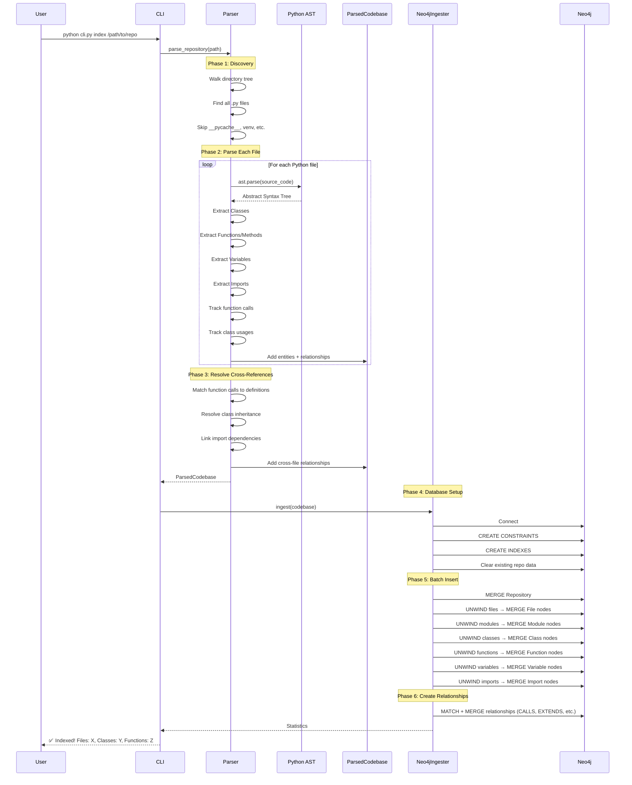

## Indexing Flow Explained

### Phase 1: Discovery
- Recursively walk the repository directory
- Filter for Python files (`.py`, `.pyw`)
- Skip ignored directories (`__pycache__`, `venv`, `node_modules`, `.git`)

### Phase 2: Parse Each File
For each Python file:
1. Read source code
2. Parse into AST (Abstract Syntax Tree)
3. Visit AST nodes to extract:
   - **Classes**: name, docstring, decorators, line numbers
   - **Functions/Methods**: signature, parameters, return type, complexity
   - **Variables**: module-level and class attributes
   - **Imports**: what modules/symbols are imported

### Phase 3: Resolve Cross-References
After all files are parsed:
1. Match function calls to their definitions
2. Resolve class inheritance chains
3. Link file imports to actual files
4. Build the DEPENDS_ON relationships

### Phase 4: Database Setup
1. Connect to Neo4j
2. Create uniqueness constraints on ID fields
3. Create indexes for fast lookups (name, path, docstring)
4. Clear any existing data for this repository

### Phase 5: Batch Insert Nodes
Using Cypher `UNWIND` for efficient batch operations:
```cypher
UNWIND $records AS record
MERGE (f:Function {id: record.id})
SET f.name = record.name, f.signature = record.signature, ...
```

### Phase 6: Create Relationships
For each relationship type:
```cypher
UNWIND $records AS record
MATCH (source:Function {id: record.sourceId})
MATCH (target:Function {id: record.targetId})
MERGE (source)-[rel:CALLS]->(target)
SET rel.lineNumbers = record.lineNumbers
```

## Relationship Types

| Relationship | Source → Target | Description |
|-------------|-----------------|-------------|
| `CONTAINS_FILE` | Repository → File | Repo contains this file |
| `CONTAINS_MODULE` | Repository → Module | Repo has this module/package |
| `BELONGS_TO_MODULE` | File → Module | File is part of module |
| `DEFINES_CLASS` | File → Class | File defines this class |
| `DEFINES_FUNCTION` | File → Function | File defines top-level function |
| `HAS_METHOD` | Class → Function | Class has this method |
| `HAS_VARIABLE` | Class → Variable | Class has this attribute |
| `EXTENDS` | Class → Class | Class inherits from |
| `IMPLEMENTS` | Class → Interface | Class implements interface |
| `CALLS` | Function → Function | Function calls another |
| `USES_CLASS` | Function → Class | Function uses/instantiates class |
| `IMPORTS` | File → Import | File has this import statement |
| `IMPORTS_FROM` | File → File | File imports from another file |
| `DEPENDS_ON` | File → File | File depends on another |
